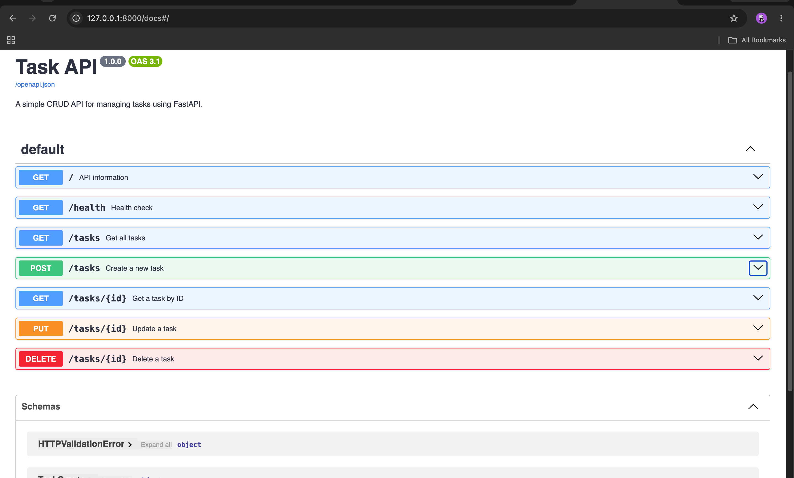

# Task API

A simple RESTful CRUD API built with FastAPI for managing tasks. This project was developed as part of my backend internship assignment.

## Features

- Create a new task
- View all tasks
- View a single task by ID
- Update an existing task
- Delete a task
- Input validation
- Interactive Swagger UI documentation
- In-memory data storage

## Technologies Used

- Python 3
- FastAPI
- Uvicorn
- Pydantic
- Swagger UI (OpenAPI)


## Installation

### 1. Clone the repository

```bash
git clone <https://github.com/fast-hashir0729-arch/Internship-Tasks.git>
```

### 2. Navigate into the project

```bash
cd CRUD-Operations
```

### 3. Create a virtual environment

```bash
python -m venv .venv
```

### 4. Activate the virtual environment

#### macOS/Linux

```bash
source .venv/bin/activate
```

#### Windows

```bash
.venv\Scripts\activate
```

### 5. Install the required packages

```bash
pip install -r requirements.txt
```


## Run the Project

Start the FastAPI development server:

```bash
uvicorn main:app --reload
```

After the server starts, open your browser and visit:

- API Documentation (Swagger UI): http://127.0.0.1:8000/docs
- Alternative Documentation (ReDoc): http://127.0.0.1:8000/redoc


## API Endpoints

| Method | Endpoint | Description | Success Status |
|--------|----------|-------------|----------------|
| GET | `/` | Returns API information | 200 OK |
| GET | `/health` | Checks if the server is running | 200 OK |
| GET | `/tasks` | Returns all tasks | 200 OK |
| GET | `/tasks/{id}` | Returns a task by its ID | 200 OK |
| POST | `/tasks` | Creates a new task | 201 Created |
| PUT | `/tasks/{id}` | Updates an existing task | 200 OK |
| DELETE | `/tasks/{id}` | Deletes a task | 204 No Content |


## Example cURL Request

Create a new task:

```bash
curl -i -X POST http://127.0.0.1:8000/tasks \
-H "Content-Type: application/json" \
-d '{"title":"Buy milk"}'
```


## Swagger UI

The API includes automatically generated interactive documentation using FastAPI's built-in Swagger UI.




## Project Structure

```
CRUD-Operations/
│
├── main.py
├── requirements.txt
├── README.md
├── .gitignore
├── screenshots/
│   └── swagger-ui.png
└── .venv/ (ignored by Git)
```


## Note

This project stores all tasks in memory using a Python list. This means that when the server is stopped or restarted, all created or updated tasks are lost.

This behavior is intentional for this assignment. In a production application, a database such as PostgreSQL, MySQL, or SQLite would be used to persist the data.
